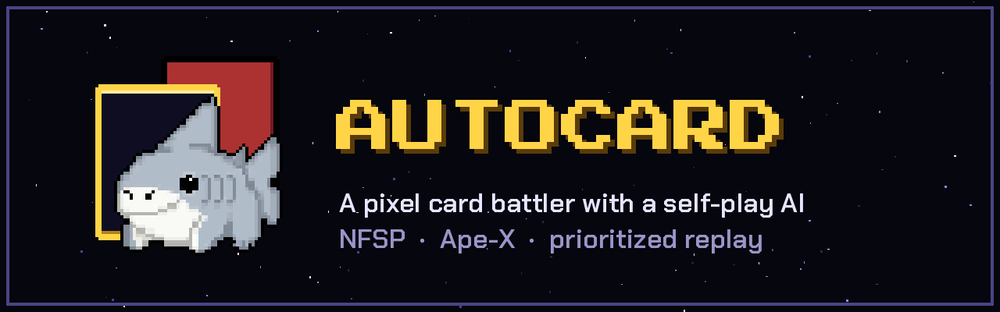
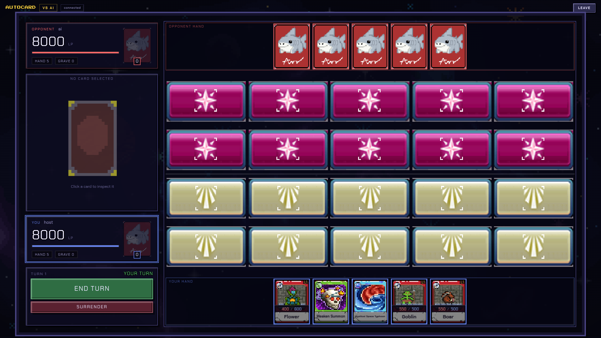
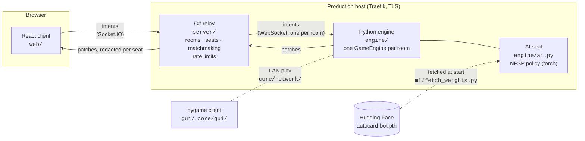
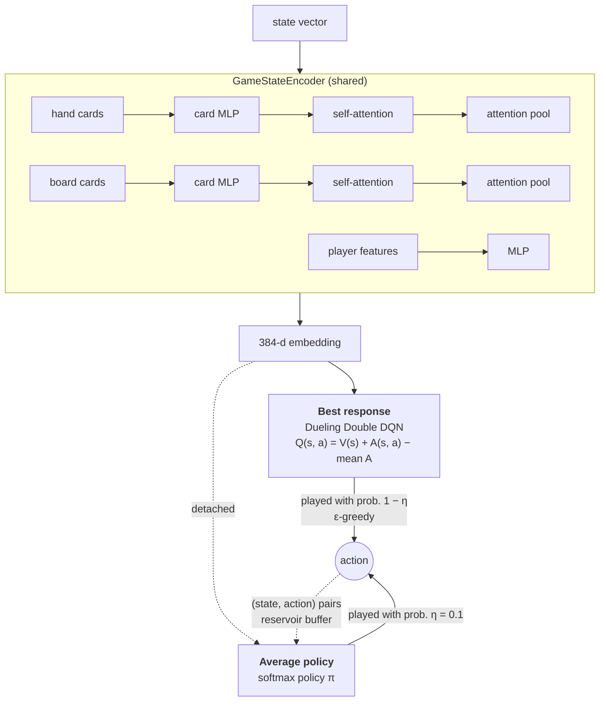
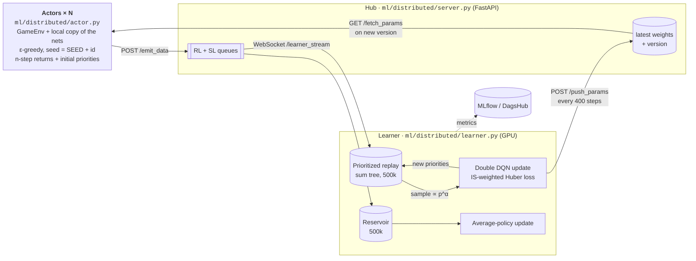

<p align="center">
  
</p>

<p align="center">
  A two-player pixel-art card battler, and an AI that learned to play it by
  playing itself.
  <br />
  <!-- TODO: replace with the production hostname (SITE_DOMAIN in deploy/.env) -->
  <a href="https://autocard.example.com"><b>▶ Play in the browser</b></a>
  ·
  <a href="#reinforcement-learning">How the AI works</a>
  ·
  <a href="docs/BACKEND.md">Protocol</a>
  ·
  <a href="deploy/README.md">Deploy</a>
</p>

<p align="center">
  
</p>

---

## Contents

- [The game](#the-game)
- [Architecture](#architecture)
- [Reinforcement learning](#reinforcement-learning)
  - [The environment](#the-environment)
  - [The agent: Neural Fictitious Self-Play](#the-agent-neural-fictitious-self-play)
  - [Distributed training with prioritized replay](#distributed-training-with-prioritized-replay)
  - [Training it yourself](#training-it-yourself)
- [Running the game](#running-the-game)
- [Project layout](#project-layout)
- [Tests](#tests)

## The game

Two players, 8000 life points each, and a 5 × 4 board. Each player holds the two
rows on their side of it.

| Card | What it does |
|---|---|
| **Monster** | Summoned onto your half of the board. It attacks enemy monsters or, when the way is clear, the opponent directly. It can switch between attack and defence position. Two matching monsters **merge** into a stronger one. |
| **Spell** | Cast from your hand for an immediate effect: buff attack or defence, clear the board (*Typhoon*), call reinforcements. |
| **Trap** | Set face-down. When its condition is met, the game pauses for a **trap stage** in which the trap's owner decides whether to spring it. A trap can dodge or reflect an attack, weaken a monster, or block a summon. |

There are 30 monsters across five factions (Scholar, Conqueror, Forest Monster,
Demon and Forest Guard), plus 5 spells and 5 traps. Card data lives in
[`assets/data/`](assets/data), and all the art is hand-drawn in Aseprite, with
the source files next to the PNGs.

You can play a friend (by room code or quick match) or the trained AI. The
browser client, the original pygame client and the training environment all
run the same rules engine.

## Architecture



- **The rules live in one place.** `core/logic/GameEngine` is authoritative.
  The browser sends *intents* that contain IDs only ("summon card X to cell
  (3, 1)") and never outcomes. The engine checks every intent before applying it.
- **State travels as diffs.** Each action runs inside a transaction that
  snapshots the engine before and after and sends the difference as a list of
  single-field *patch* operations.
- **Each player sees only what they should.** `engine/visibility.py` redacts
  the board separately for each seat before the diff is taken, so a player never
  receives the opponent's hand or face-down cards.
- **The relay never reads game data.** It handles rooms, identity and fan-out,
  and doesn't inspect gameplay messages.
- **The AI plays through the training environment.** A single-player seat is
  driven by the same `GameEnv` the agent was trained in, so a checkpoint
  behaves the same in a live match as it did in self-play.

The complete wire protocol, including every intent, every patch op and board
orientation, is in [`docs/BACKEND.md`](docs/BACKEND.md).

## Reinforcement learning

### The environment

[`ml/environment/environment.py`](ml/environment/environment.py) wraps the real
`GameEngine` in a step-based interface. Nothing is re-implemented for training:
the agent's moves go through the same code as a human's.

```python
from core.data.player import Player
from core.logic.game_engine import GameEngine
from ml.environment.environment import GameEnv

engine = GameEngine(players=[Player(player_index=0, name="p1"),
                             Player(player_index=1, name="p2", is_opponent=True)])
env = GameEnv(engine)
env.reset()

done = False
while not done:
    player = env.get_acting_player()                  # current player, or the trapper during a trap stage
    state = env.get_state(player)                     # flat float32 vector from that player's point of view
    mask, legal = env.get_legal_actions(player)       # bool[461] and {action_id: (name, params)}
    action_id = agent.select(state, mask)
    next_state, reward, done = env.step(action_id)    # step(None) plays a random legal move
```

**Two acting players.** The environment is turn-based but not strictly
alternating. During a trap stage the *defending* player acts in the middle of
the attacker's turn. `get_acting_player()` resolves this, and both seats are
trained by the same network through self-play.

**Action space: 461 discrete actions.**
[`ActionCodec`](ml/environment/action_codec.py) flattens every parameterised
move into a single index. Each move type is a block, and the block's size is the
product of its parameter dimensions:

| Block | Parameters | Size |
|---|---|---:|
| `end_turn` | — | 1 |
| `summon` | hand slot | 10 |
| `set_trap` | hand slot | 10 |
| `cast_spell` | hand slot × target (10 own + 10 enemy + none) | 210 |
| `attack` | attacker × target (10 slots + player) | 110 |
| `toggle` | field slot | 10 |
| `combine` | slot × slot | 100 |
| `activate_trap` | trap slot | 10 |

Illegal actions are masked out before selection: masked Q-values are set to
`-inf`, and the policy's probabilities are renormalised. The agent never has to
learn what's legal. New blocks are only ever appended, so existing action IDs,
and therefore checkpoints, keep working.

**Observation.** [`encoder.py`](ml/environment/encoder.py) writes three parts:
features for both players (life, hand size, per-turn flags), up to 10 hand cards,
and up to 20 board cards. Each card has a presence bit, one-hot type, faction and
mode, normalised stats, and its active effects with their values and durations.
The agent sees only what a player at the table would see. Its own hand is
encoded, but the opponent's isn't. The opponent's face-down traps are present on
the board, with their abilities blanked until they trigger.

**Reward shaping.** [`reward_system.py`](ml/environment/reward_system.py) adds
dense per-action terms to the sparse ±2 for winning or losing. Rewards and
penalties include:

- destroying a monster, a direct attack, dealing damage (scaled
  logarithmically to reduce variance), springing a trap
- a decaying bonus for board advantage
- merging, a spell combo, or a summon that baits out a trap
- ending the turn early while useful moves remain, or having an empty board

Every weight is a field on `RewardConfig`.

### The agent: Neural Fictitious Self-Play

AutoCard is a two-player game with hidden information, so the agent uses
[NFSP](https://arxiv.org/abs/1603.01121) (Heinrich & Silver, 2016). Plain
self-play DQN tends to cycle between strategies that each beat the previous one.
NFSP trains two networks side by side:



- The **best-response network** is a Dueling Double DQN with 3-step returns. It
  learns to exploit the opponent's current behaviour.
- The **average-policy network** is trained by supervised learning
  (cross-entropy) on (state, action) pairs from self-play, which are kept in a
  **reservoir buffer** so that old and new behaviour are sampled evenly. It
  models the agent's *average* strategy, which is the part that approaches a
  Nash equilibrium. Mixing it into self-play keeps the best response from
  chasing a moving target. The deployed AI (`ml/ai_opponent.py`) plays the
  best-response network greedily.
- Both networks share one **attention-based state encoder**: a card-level MLP,
  a transformer block over the set of cards, and attention pooling. Hands and
  boards are unordered sets, and card interactions matter more than slot
  positions. Only the DQN's gradients update the encoder.

### Distributed training with prioritized replay

Rollouts on CPU are the bottleneck, so training follows
[Ape-X](https://arxiv.org/abs/1803.00933) (Horgan et al., 2018). Many actor
processes generate experience, one GPU learner consumes it, and a small hub
connects them. Any machine that can reach the hub can add actors.



**Priority sampling.** The learner keeps a prioritized replay buffer
([`prioritized_replay_buffer.py`](ml/storage/prioritized_replay_buffer.py)). It
samples transition *i* with probability

$$P(i) = \frac{p_i^{\alpha}}{\sum_k p_k^{\alpha}}, \qquad w_i = \left(\frac{1}{N \cdot P(i)}\right)^{\beta} \Big/ \max_j w_j$$

with α = 0.6 and β = 0.4. A sum tree and a min tree
([`segment_tree.py`](ml/storage/segment_tree.py)) make sampling and priority
updates O(log N) over 500k transitions. The importance weights *w* scale the
Huber loss to correct the bias introduced by non-uniform sampling.

**Actors compute the first priorities.** In standard PER, new transitions get
the maximum priority until the learner has seen them. Here each actor stores
the Q-values it already computed when choosing an action
([`batch_storage.py`](ml/storage/batch_storage.py)), builds 3-step returns
locally, and sends each transition with its TD error:

$$p_i = \left| \sum_{k=0}^{n-1} \gamma^k r_{t+k} + \gamma^n \max_{a'} Q(s_{t+n}, a') - Q(s_t, a_t) \right| + \epsilon$$

As a result, the learner never runs a forward pass just to score incoming data,
and a surprising transition is likely to be sampled the moment it arrives. After
each gradient step, the learner writes the fresh |δ| of the sampled batch back
into the tree.

**Fault tolerance.** Actors register with the hub, back off exponentially when
it's unreachable, and pause while the learner is disconnected. Data is sent and
weights are pulled on background threads, so rollouts never wait on the
network. An actor that stops reporting is dropped after `ACTOR_TTL` seconds, and
the hub keeps its queues and latest weights when the learner reconnects.

### Training it yourself

Install the training extras (MLflow, DagsHub, tqdm, websocket-client):

```bash
uv sync --extra training
```

Start the three roles in any order. They find each other through the hub:

```bash
./run.sh --server                 # the hub on :5000; open it in a browser for the dashboard
./run.sh --learner --device cuda  # one learner, ideally on a GPU
./run.sh --actor --count 8        # as many actors as you have cores, on any machine
```

Actors and the learner read `SERVER_URL` and `AUTH_CODE` from the environment
or from `.env`.

To train on one machine without the hub, run:

```bash
python main.py --train --device cuda            # add --render to watch, --resume to continue
```

This single-process mode uses a uniform replay buffer. Prioritized replay is
only used in the distributed setup.

Metrics are sent to MLflow. For a local tracking server backed by Postgres, run
`docker compose -f ml/docker-compose.yaml up` (copy `ml/.env.example` to
`ml/.env` first). Checkpoints are written to `saves/`.

<details>
<summary><b>Key hyperparameters</b> (<code>ml/config.py</code>)</summary>

| | Value |
|---|---|
| Discount γ | 0.98 |
| Multi-step n | 3 |
| Learning rate | 1e-4 (Adam, grad-norm clip 1.0) |
| Batch size | 512 |
| Replay / reservoir capacity | 500,000 each |
| Learning starts after | 30,000 transitions |
| PER α / β | 0.6 / 0.4 |
| NFSP anticipatory η | 0.1 |
| ε schedule | 1.0 → 0.05 over 750k frames |
| Target network sync | every 4,000 steps |
| Weights pushed to actors | every 400 steps |
| Max actions per episode | 300 |

</details>

## Running the game

The project uses [uv](https://docs.astral.sh/uv/) and Python 3.13.

```bash
uv sync
```

**Desktop (pygame).** The original client, with a menu for local play, LAN play
and playing against the AI:

```bash
python main.py
```

**Web.** Start the engine and relay, then the Vite dev server:

```bash
server/dev.sh                     # engine on :9000, relay on :8080 (needs .NET 10)
cd web && npm install && npm run dev
```

To play the AI, create a room in AI mode, or join any room code that starts
with `ai-`.

**AI weights.** The trained checkpoint isn't stored in git. It's a release
artifact on Hugging Face:

```bash
python -m ml.fetch_weights        # downloads to saves/checkpoint.pth
```

If no checkpoint is present, the AI still runs, but with untrained weights.

**Production.** The site runs as three containers behind Traefik, deployed from
GitHub Actions with Ansible. See [`deploy/README.md`](deploy/README.md).

## Project layout

```
core/         rules engine, card factories, patch protocol (shared by every client)
  logic/        GameEngine, turn manager, battle / spell / trap / summon / upgrade engines
  network/      intents, patches, LAN transport
engine/       authoritative engine service: rooms, AI seat, per-seat visibility
server/       C# Socket.IO relay: rooms, seats, matchmaking, rate limits
web/          React client
gui/          pygame client: sprites, animations, effects
ml/
  environment/  GameEnv, action codec, state encoder, reward shaping
  models/       attention state encoder, Dueling DQN, average policy
  storage/      PER + segment trees, reservoir, n-step batch storage
  trainer/      single-process NFSP trainer, MLflow logging
  distributed/  Ape-X actor, learner, hub
assets/       card art (.aseprite + .png), sounds, card data
deploy/       Dockerfiles, compose, Ansible playbook, Traefik config
docs/         protocol and backend guide
```

## Tests

```bash
uv sync --extra dev
SDL_VIDEODRIVER=dummy SDL_AUDIODRIVER=dummy PYTHONPATH=. pytest -q
```

CI runs these tests, a startup check against the engine's `/health` endpoint,
the relay build, the web build, and a check that the checkpoint URL is still
reachable.
